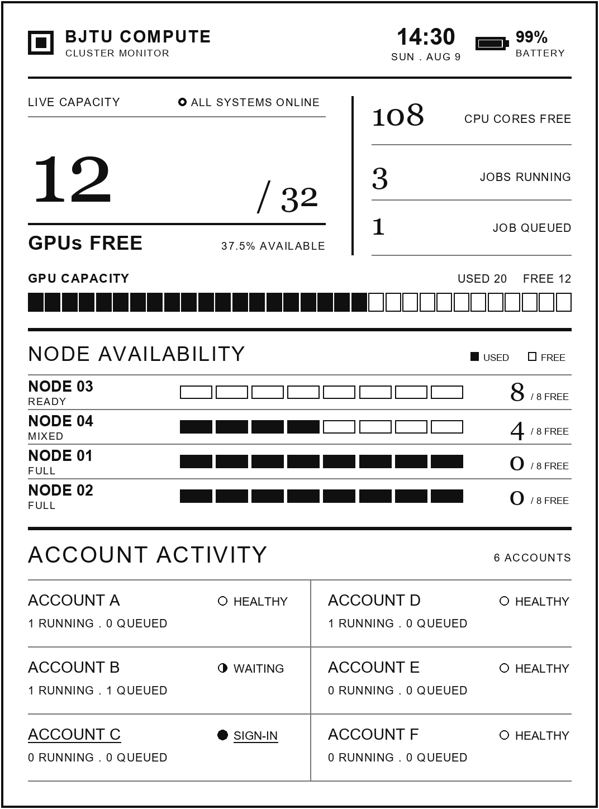
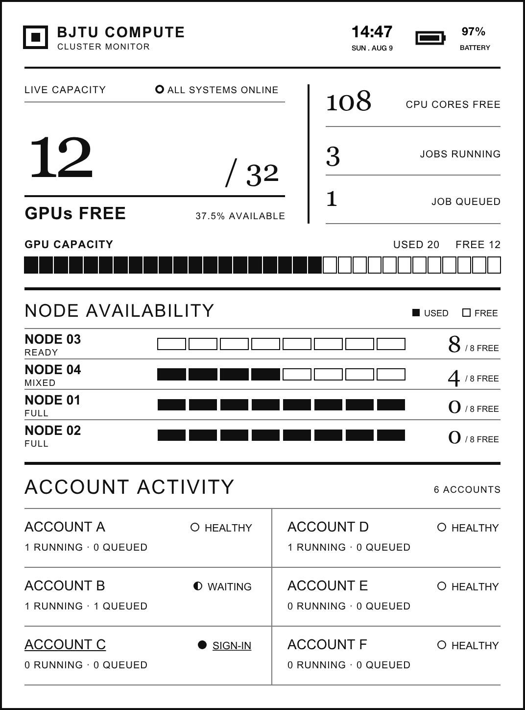

# BJTU Kindle Dashboard




A data-driven, grayscale cluster dashboard for a Kindle Paperwhite 3. Edit one
JSON file, render a pixel-accurate 1072 × 1448 PNG, and optionally deploy it to
a jailbroken Kindle over SSH.

## Features

- Updates GPU, CPU and job counters from JSON.
- Rebuilds GPU and per-node capacity blocks automatically.
- Updates four node states and six account activity cards.
- Produces an 8-bit grayscale PNG optimized for a PW3 display.
- Supports a blank header for the native sleep hook or standalone time,
  date and battery rendering.
- Can deploy and refresh the image through an existing SSH alias.
- Includes an optional resident Kindle service for low-frequency RTC updates.
- Can turn the local BJTU HPC Widget snapshot into an anonymized live lock screen.
- Includes a purpose-built landscape layout for clockwise 90° physical placement.

## Install

```bash
python -m pip install -r requirements.txt
```

The renderer looks for Arial and Georgia on Windows, Liberation fonts on
Linux, and common macOS system fonts.

## Update the data

Edit [`data/dashboard.json`](data/dashboard.json), then render:

```bash
python scripts/update_dashboard.py data/dashboard.json \
  --output panel-base.png
```

Use values from the JSON header in a standalone image:

```bash
python scripts/update_dashboard.py data/dashboard.json \
  --header-mode data \
  --output dashboard.png
```

Use the computer's current time and date:

```bash
python scripts/update_dashboard.py data/dashboard.json \
  --header-mode now \
  --output dashboard.png
```

Render for a Kindle that will be placed clockwise/right by 90°:

```bash
python scripts/update_dashboard.py data/dashboard.json \
  --orientation right \
  --header-mode data \
  --output dashboard-right-native.png
```

The file remains a native 1072 × 1448 grayscale PNG; the renderer composes a
1448 × 1072 landscape UI and pre-rotates it for the physical placement.

## Deploy to Kindle

With an SSH alias such as `kindle` already configured:

```bash
python scripts/update_dashboard.py data/dashboard.json \
  --output panel-base.png \
  --deploy kindle
```

The default deployment target is:

```text
/mnt/us/extensions/bjtu-native-screensaver/assets/panel-base.png
```

The command then runs the installed native screen hook's `render-panel.sh`.
Override either path with `--remote-image` and `--remote-render`.

## Install scheduled updates

The updater is a separate KUAL/Upstart extension and requires the native sleep
hook above. Deploy it through an existing Kindle SSH alias:

```bash
python scripts/deploy_kindle_updater.py kindle
```

Its default public source is `assets/panel-base.png` from this repository,
fetched through GitHub's raw Contents API. If a Kindle network cannot reach
GitHub, the Mac can instead publish the anonymized PNG over SSH to the bundled
minimal HTTPS edge server. For a private endpoint, keep the URL in the
USB-visible `update.conf`, and place trust/authentication options only in the Kindle's root-owned
`/var/local/bjtu-dashboard/curl.conf`.
The service never sources `update.conf`: it accepts only documented keys and rejects
duplicates, shell syntax, malformed URLs, and out-of-range integers before starting.

Useful device-side commands:

```bash
/mnt/us/extensions/bjtu-dashboard-updater/bin/control.sh status
/mnt/us/extensions/bjtu-dashboard-updater/bin/control.sh fetch-now
/mnt/us/extensions/bjtu-dashboard-updater/bin/control.sh restart
/mnt/us/extensions/bjtu-dashboard-updater/bin/control.sh disable
```

The service never simulates a power-button event. When locked on external power,
it keeps the screen-saver state online with a short, renewed suspend grace and
checks ETag every five minutes. Unlocking or unplugging releases that hold. On
battery it writes RTC only after the final suspend level, wakes into the
screensaver, opens a bounded network window with `abortSuspend`, and then allows
normal suspend to resume. RTC tests always require the user to lock the device.

## Documentation

- [Native sleep hook design (简体中文)](docs/native-sleep-hook.zh-CN.md)
- [Connecting to Kindle from Windows (简体中文)](docs/connect-kindle.zh-CN.md)
- [Scheduled updates while suspended (简体中文)](docs/scheduled-sleep-updates.zh-CN.md)
- [RTC wake and background Wi-Fi validation (简体中文)](docs/rtc-wifi-validation.zh-CN.md)
- [Local HPC Widget to Kindle sync (简体中文)](docs/hpc-widget-sync.zh-CN.md)
- [Clockwise 90° lock-screen layout (简体中文)](docs/rotation-layout.zh-CN.md)

All guides use placeholders for network addresses, local usernames and key
paths. They do not contain credentials or device identifiers.

## Data layout

- `accounts` must contain six entries. Entries 1–3 are placed in the left
  column and entries 4–6 in the right column.
- Account status is one of `HEALTHY`, `WAITING`, or `SIGN-IN`.
- `nodes` must contain four entries; block widths adapt to each node's total.
- `gpus_free` cannot exceed `gpus_total`.

The generated `assets/panel-base.png` uses a blank header so the native Kindle
hook can overlay the device's current time, date and battery level.

## Test

```bash
python -m unittest discover -s tests -v
```

## Kindle framebuffer capture

The image below was captured from the Kindle framebuffer after deployment:



## License

MIT
