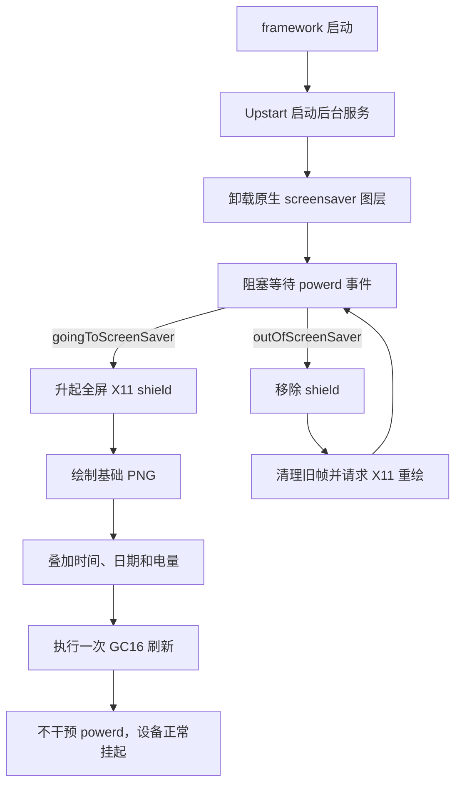

# Kindle 原生休眠钩子设计

本文记录本项目配套的 Kindle 原生休眠钩子：设备进入休眠时显示
仪表盘，唤醒时恢复 Kindle 原生界面，并且不阻止系统进入正常挂起状态。

文中的设备地址、SSH 别名和本机目录均为占位符，不对应任何真实设备。

## 1. 适用范围

当前实现以分辨率为 1072 × 1448 的 Kindle Paperwhite 3 为参考设备，要求：

- 设备已完成越狱，并能运行 KUAL 扩展；
- 已安装 USBNetwork，能够以 `root` 身份连接 SSH；
- 设备上有可用的 FBInk；
- Kindle 原生界面仍由 `framework`、`powerd` 和 `blanket` 管理。

不同型号或固件可能使用不同的内部事件、屏幕尺寸和组件名称。部署到其他
型号前，应先确认分辨率、FBInk 兼容性以及 LIPC 事件是否存在。

## 2. 设计目标

- 休眠前显示最新的 8 位灰度仪表盘；
- 只在休眠和唤醒事件发生时工作，不进行定时轮询；
- 只执行一次完整的 GC16 刷新，减少闪烁和无效屏幕更新；
- 不延迟、不替换 `powerd` 原本的挂起流程；
- 绘制失败、服务停止或扩展卸载后恢复 Amazon 原生屏保；
- 所有操作均可通过 KUAL 或 SSH 撤销。

它不是固件补丁，也不会修改设备注册状态、广告状态或 Amazon 账户数据。

## 3. 总体结构



核心原则是“事件驱动”。`lipc-wait-event` 在没有事件时阻塞，不会像
`while + sleep` 那样周期性唤醒进程。仪表盘绘制完成后，后台服务没有持续的
屏幕、网络或 CPU 活动。

## 4. 安装后的目录

```text
/mnt/us/extensions/bjtu-native-screensaver/
├── enabled
├── install.sh
├── menu.json
├── assets/
│   └── panel-base.png
├── bin/
│   ├── control.sh
│   ├── daemon.sh
│   ├── render-panel.sh
│   ├── ss_shield
│   ├── luajit
│   └── xrefresh.lua
├── logs/
│   └── service.log
└── upstart/
    └── bjtu-native-screensaver.conf

/etc/upstart/bjtu-native-screensaver.conf
```

各组件职责如下：

| 组件 | 职责 |
| --- | --- |
| `bjtu-native-screensaver.conf` | 在 `framework` 启动后拉起服务，异常退出时限速重启 |
| `daemon.sh` | 监听休眠/唤醒事件，管理 shield 和恢复流程 |
| `render-panel.sh` | 使用 FBInk 绘制基础图片并叠加设备实时状态 |
| `panel-base.png` | 由本仓库渲染器生成的静态仪表盘区域 |
| `ss_shield` | 提供全屏 X11 遮罩，避免休眠期间状态栏覆盖帧缓冲 |
| `xrefresh.lua` | 唤醒时向原生 X11 界面发送重绘请求 |
| `control.sh` | KUAL 和 SSH 共用的启用、停用、预览及状态入口 |

## 5. 启动过程

Upstart 作业在 `framework` 启动后运行，并先检查扩展目录下是否存在
`enabled` 标记。服务包含 `respawn`，但限制为 60 秒内最多 5 次，避免故障时
形成无限重启循环。

后台服务启动时执行以下检查：

1. `panel-base.png` 和 `ss_shield` 是否存在；
2. 依次在 USBNetwork、libkh 和 KOReader 目录中寻找 FBInk；
3. PID 文件对应的旧进程是否仍在运行；
4. 检查通过后卸载 Amazon 原生 `screensaver` 图层；
5. 分别监听 `goingToScreenSaver` 与 `outOfScreenSaver`。

任一关键资源缺失时，服务不会接管屏保，并立即重新加载原生屏保。

## 6. 休眠事件

收到 `goingToScreenSaver` 后：

1. 清理可能残留的旧 shield；
2. 在 `DISPLAY=:0` 上启动新的全屏 `ss_shield`；
3. 使用 FBInk 将 `panel-base.png` 写入帧缓冲；
4. 从设备读取当前时间、日期和 `battLevel`；
5. 使用 Kindle 自带 Helvetica 字体叠加这些字段；
6. 中间绘制均使用 FBInk 的批处理方式，不逐项刷新屏幕；
7. 最后执行一次完整 GC16 刷新；
8. 立即返回，让 `powerd` 继续原有的挂起流程。

基础图片的标题栏应使用 `--header-mode blank` 生成，避免电脑生成的时间与
Kindle 叠加的实时时间重复。

绘制失败时，服务会撤下 shield 并恢复原生屏保。失败不会阻止休眠。

## 7. 唤醒事件

收到 `outOfScreenSaver` 后：

1. 终止并移除 `ss_shield`；
2. 通过 FBInk 清除残留帧；
3. 运行 `xrefresh.lua`，请求原生 X11 窗口重绘；
4. 返回事件等待状态。

因此唤醒后看到的仍是 Kindle 原生阅读或主页界面，而不是一个常驻前台应用。

## 8. 为什么这一方案省电

- 没有固定间隔的轮询进程；
- 没有为了更新面板而设置 RTC 周期唤醒；
- 没有在深度休眠期间保持 Wi-Fi 或 SSH 活跃；
- 每次休眠只合成一次图片、执行一次完整墨水屏刷新；
- shield 只用于保护休眠画面，不改变 `powerd` 的挂起决策。

如果以后加入远程数据更新，建议在设备已经唤醒且 Wi-Fi 可用时预取数据。
休眠事件中最多进行一次带严格超时的读取，失败立即使用最后成功缓存，不能让
网络请求阻塞挂起。

## 9. 安装与控制

假设扩展已经复制到上述目录，可在 SSH 中安装：

```sh
chmod 755 /mnt/us/extensions/bjtu-native-screensaver/install.sh
/mnt/us/extensions/bjtu-native-screensaver/install.sh install
```

安装器会短暂将根文件系统重新挂载为可写，安装 Upstart 作业后重新切回只读。
如果目标位置已有不属于本项目的同名作业，会先保留 `.before-bjtu` 备份。

常用命令：

```sh
EXT=/mnt/us/extensions/bjtu-native-screensaver
$EXT/bin/control.sh status
$EXT/bin/control.sh show
$EXT/bin/control.sh restart
$EXT/bin/control.sh disable
$EXT/bin/control.sh enable
```

相同操作也可以从 KUAL 的 `BJTU Native Screensaver` 菜单执行。

## 10. 更新面板

在电脑上生成不包含标题栏实时字段的基础图片：

```powershell
python scripts/update_dashboard.py data/dashboard.json `
  --header-mode blank `
  --output panel-base.png
```

正常部署可使用仓库脚本和 SSH 别名：

```powershell
python scripts/update_dashboard.py data/dashboard.json `
  --output panel-base.png `
  --deploy kindle
```

若需要避免休眠事件恰好读到尚未传输完成的文件，可在同一目录上传临时文件后
再替换：

```powershell
scp -O panel-base.png kindle:/mnt/us/extensions/bjtu-native-screensaver/assets/panel-base.png.incoming
ssh kindle "chmod 644 /mnt/us/extensions/bjtu-native-screensaver/assets/panel-base.png.incoming && mv -f /mnt/us/extensions/bjtu-native-screensaver/assets/panel-base.png.incoming /mnt/us/extensions/bjtu-native-screensaver/assets/panel-base.png"
```

设备处于唤醒状态时，可以手动预览：

```powershell
ssh kindle /mnt/us/extensions/bjtu-native-screensaver/bin/control.sh show
```

## 11. 日志与诊断

检查状态和最近日志：

```sh
/mnt/us/extensions/bjtu-native-screensaver/bin/control.sh status
tail -n 80 /mnt/us/extensions/bjtu-native-screensaver/logs/service.log
```

日志超过 256 KiB 后保留一份轮换文件 `service.log.1`。日志只记录事件、进程和
绘制结果，不应写入 SSH 密码、更新令牌、设备序列号或账户信息。

建议依次验证：

1. `status` 返回 `enabled running`；
2. `show` 能显示完整仪表盘；
3. 按电源键休眠后出现仪表盘；
4. 再次唤醒后原生界面正常重绘；
5. 放置一段时间后电量变化符合正常深度休眠表现。

## 12. 停用与卸载

临时停用并恢复原生屏保：

```sh
/mnt/us/extensions/bjtu-native-screensaver/bin/control.sh disable
```

卸载 Upstart 作业并恢复原生屏保：

```sh
/mnt/us/extensions/bjtu-native-screensaver/install.sh uninstall
```

卸载会删除 `/etc/upstart/bjtu-native-screensaver.conf`，并在存在备份时恢复原作业。
扩展目录会保留，便于重新安装；确认原生屏保已经恢复后，可再手动删除该目录。

紧急情况下，即使后台服务异常，停止服务或重启设备也会触发清理逻辑，重新加载
Amazon 原生屏保。

## 13. 已知边界

- LIPC、`blanket` 和 X11 均属于 Kindle 固件内部接口，未来固件可能改变；
- 屏幕坐标和字体布局针对 1072 × 1448 设计；
- Kindle 深度休眠时通常不会维持 WLAN SSH，部署前应先唤醒设备；
- 该方案显示的是静态缓存，不承诺休眠期间继续获取实时数据；
- 固件升级前应先停用扩展，并保留可通过 USB 恢复的副本。
