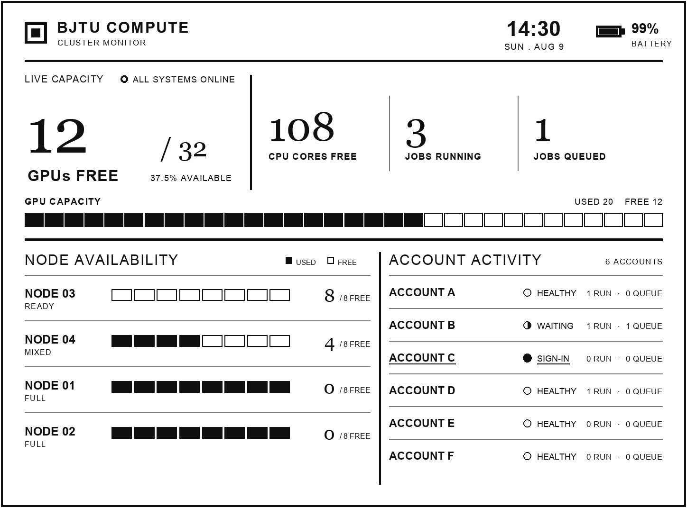

# Kindle 右转 90° 锁屏界面

本项目支持把 Kindle 顺时针右转 90° 后横向放置。横屏不是把竖屏卡片简单放大，
而是在 1448 × 1072 的逻辑画布上重新排版，再逆时针预旋转为设备原生的
1072 × 1448、8 位灰度 PNG。



## 为什么采用图片预旋转

Kindle 固件仍按竖屏管理 X11、framework 与触摸坐标。运行时修改 framebuffer
方向会同时影响原生界面，固件升级后也更容易失效。因此本方案不调用
`fbdepth` 改变方向，也不改变系统旋转状态；FBInk 仍只接收一张原生尺寸图片。

当设备顺时针右转时，图片必须预先逆时针旋转。渲染器会自动完成这一步：

```bash
python scripts/update_dashboard.py data/dashboard.json \
  --orientation right \
  --header-mode data \
  --output panel-base.png
```

输出文件仍是 1072 × 1448，直接传给现有下载、SHA-256、原子替换和 FBInk
流程即可。不要把逻辑画布的 1448 × 1072 预览文件部署到设备。

## 信息层级

- 顶部：集群名称，以及在独立预览模式下显示的时间和电量；
- 上半区：GPU 空闲量为第一视觉焦点，CPU 与作业数并列；
- 中部：完整 GPU 容量条；
- 下半区左侧：四个匿名节点及各自 GPU 块；
- 下半区右侧：六个匿名账户、状态和作业数量。

横屏观看距离通常比手持竖屏更远，因此保留大号 GPU 数字，减少分隔线密度，
并把节点与账户拆成左右两个稳定区域。

## 与本机 Widget 定时同步

一次性选择右转模式：

```bash
python scripts/run_hpc_kindle_sync.py \
  --orientation right \
  --snapshot /path/to/snapshot.json \
  --runtime-dir /path/to/runtime \
  --ssh-target EDGE_ALIAS
```

安装 macOS LaunchAgent 时同样传入 `--orientation right`。方向被纳入语义摘要，
所以从 `portrait` 切到 `right` 即使 HPC 数值没有变化，也会强制重新渲染并发布。

切回竖屏时把参数改为 `--orientation portrait`。当前发布器的一个 URL 对应一个
活动方向；这是明确的人工选择，不尝试从 Kindle 加速度计推断摆放方向。

## 设备端方向契约

USB 可见的 `update.conf` 增加严格枚举：

```text
DISPLAY_ORIENTATION=right
```

只接受 `portrait` 或 `right`。下载器把有效值原子写入 root 私有状态文件
`/var/local/bjtu-dashboard/orientation`，供原生休眠钩子读取。

右转图已经包含横向标题栏。现有原生钩子的时间、日期与电量文字是按竖屏坐标
绘制的，不能直接叠加到右转图上。因此 `render-panel.sh` 在读到 `right` 时应只
绘制基础 PNG 和最终 GC16 刷新，跳过设备实时状态文字；竖屏模式保持原行为。
这避免出现旋转方向错误的第二套文字。实机钩子完成该判断前，不应把右转模式
标记为已验证。

## 验证清单

1. 逻辑预览为 1448 × 1072，文字在电脑上正向；
2. 部署文件为 1072 × 1448、8 位灰度 PNG；
3. Kindle 顺时针右转后，文字水平且账户列位于视觉右侧；
4. `DISPLAY_ORIENTATION=right` 不出现竖向或重叠的时间、电量文字；
5. 切回 `portrait` 会重新渲染，且竖屏实时状态恢复；
6. 两种方向都保留 ETag、大小校验、SHA-256 和原子替换行为；
7. 锁定、RTC 唤醒、后台更新和自然深度休眠不因方向选择而改变。

## 当前边界

- 仅实现正常竖屏和顺时针右转 90°；左转与倒置没有开放，避免错误配置；
- 方向切换是人工配置，不自动旋转；
- 右转模式暂不叠加设备实时电量与时钟，以保证方向正确且不引入 framebuffer
  旋转；
- 分辨率仅针对 Kindle Paperwhite 3 的 1072 × 1448 屏幕验证。
