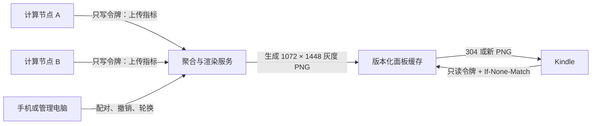

# Kindle 休眠期间定时更新实现设计

本文描述如何在保留 Kindle 正常硬件挂起能力的前提下，让休眠面板进行低频更新。
核心方式不是让 Wi-Fi 在挂起期间常开，而是使用 RTC 定时唤醒，在受限的联网
窗口中拉取一张预先生成的面板图片，随后立即重新挂起。

> 当前状态：本文是下一阶段的实现规格。仓库中的图片渲染器和已部署的原生
> 休眠钩子可以作为基础，但当前钩子尚未包含周期唤醒和网络下载逻辑。

> 2026-08-10 已在 Kindle Paperwhite 3、固件 5.16.2.1.1 上完成一次 RTC
> 唤醒和后台 Wi-Fi 验证。实测结论及失败路径见
> [RTC 唤醒与后台 Wi-Fi 实测记录](rtc-wifi-validation.zh-CN.md)。本文已按该结果
> 修正 RTC 写入时机和联网窗口流程。

文中的域名、设备标识、令牌和地址均为占位符，不对应真实设备。

## 1. 目标

- Kindle 大部分时间保持正常挂起，不维持常驻 Wi-Fi；
- 电池供电时默认每 60 分钟检查一次，充电时默认每 10 分钟检查一次；
- 服务端数据没有变化时，不下载图片、不刷新墨水屏；
- 每次后台联网窗口不超过 30 秒；
- 更新失败时继续显示最后一次成功的图片；
- 用户主动唤醒时不被后台更新重新锁定或再次挂起；
- 电量低于阈值时停止计划更新；
- 令牌、密码和设备标识不进入图片、日志、USB 用户分区或 Git 仓库；
- 功能可以从 KUAL 一键停用，且不影响现有原生屏保恢复流程。

## 2. 非目标

- 不承诺休眠时随时接受 SSH 入站连接；
- 不进行动画、秒级刷新或持续长连接；
- 不在 Kindle 上运行完整 Python/Pillow 渲染环境；
- 不修改 Amazon 注册、广告、同步或账户状态；
- 不用 `preventScreenSaver=1` 让设备长期处于假休眠；
- 不以关闭 TLS 验证的方式兼容旧网络工具。

## 3. 基本约束

墨水屏在断电后仍能保留画面，但只有 CPU 被唤醒时才能改变帧缓冲。Kindle 真正
进入系统挂起后，普通进程、Wi-Fi 和 SSH 均无法继续运行。因此“休眠更新”实际是：

```text
挂起 → RTC 唤醒 → 短暂联网 → 更新或跳过 → 重新挂起
```

Kindle 的 `rtcWakeup` 只能在 `readyToSuspend` 阶段可靠设置。KOReader 的 Kindle
电源实现也在这个事件中安排 RTC 任务，并在 `wakeupFromSuspend` 后判断计划唤醒。

参考：

- [KOReader Kindle powerd 实现](https://github.com/koreader/koreader/blob/master/frontend/device/kindle/powerd.lua)
- [KOReader Kindle 设备事件处理](https://github.com/koreader/koreader/blob/master/frontend/device/kindle/device.lua)
- [KOReader 网络休眠与恢复处理](https://github.com/koreader/koreader/blob/master/frontend/ui/network/networklistener.lua)

这些接口属于 Kindle 固件内部实现，不是稳定的公开 API。安装前必须在目标固件上
执行能力探测和一次性测试。

## 4. 推荐架构



数据源负责上传指标，聚合端负责验证数据并调用本仓库渲染器生成 PNG。Kindle 只
下载成品图片，仍由现有 `render-panel.sh` 叠加本机时间、日期和电量。

与“Kindle 下载 JSON 后本地渲染”相比，该结构具有以下优势：

- 不需要在 Kindle 上安装 Pillow、字体和 Python 运行时；
- 唤醒时间更短；
- 服务端可以提前验证图片尺寸、模式和哈希；
- ETag 未改变时只处理一个很小的 HTTP 响应；
- 数据源令牌不会出现在 Kindle 上。

## 5. 服务器接口

### 5.1 数据源上传

```http
POST /v1/sources/<SOURCE_ID>/metrics
Authorization: Bearer <SOURCE_WRITE_TOKEN>
Content-Type: application/json
```

每台数据源设备使用独立的只写令牌，权限限定为：

```text
metrics:write:<SOURCE_ID>
```

服务端完成 JSON schema 验证、时间戳校验和数值范围校验后，合并数据并运行：

```bash
python scripts/update_dashboard.py data/current.json \
  --header-mode blank \
  --output panel-base.png
```

渲染结果必须满足：

- PNG；
- 1072 × 1448；
- 8 位灰度；
- 文件大小不超过配置上限；
- 生成成功后才原子替换公开版本。

### 5.2 Kindle 拉取

为了避免在 Kindle 上解析复杂 JSON，第一版直接提供图片端点：

```http
GET /v1/dashboards/<DASHBOARD_ID>/panel.png
Authorization: Bearer <DASHBOARD_READ_TOKEN>
If-None-Match: "<LAST_ETAG>"
```

权限限定为：

```text
dashboard:read:<DASHBOARD_ID>
```

无变化时：

```http
HTTP/1.1 304 Not Modified
ETag: "<VERSION>"
```

有变化时：

```http
HTTP/1.1 200 OK
Content-Type: image/png
Content-Length: <BYTES>
ETag: "<VERSION>"
X-Dashboard-SHA256: <64_HEX_CHARACTERS>
X-Dashboard-Generated-At: <UTC_TIMESTAMP>
```

服务端不得通过 URL 查询参数接收令牌，因为 URL 容易进入代理、访问日志和历史
记录。`ETag` 应表示图片内容版本，而不是用户会话。

## 6. Kindle 文件布局

计划在现有扩展中增加：

```text
/mnt/us/extensions/bjtu-native-screensaver/
├── assets/
│   └── panel-base.png
├── bin/
│   ├── daemon.sh
│   ├── render-panel.sh
│   ├── scheduled-update.sh
│   ├── fetch-panel.sh
│   ├── network-window.sh
│   ├── curl
│   ├── sha256sum
│   └── validate-png
├── config/
│   └── scheduled-update.conf
└── share/
    └── ca-bundle.crt

/var/local/bjtu-dashboard/
├── credentials.conf
├── enabled
├── etag
├── last-sha256
├── last-success-epoch
├── failure-count
└── displaced-rtc-epoch
```

说明：

- `/mnt/us` 会通过 USB 磁盘暴露，只保存程序和非敏感图片；
- 只读令牌保存到 `/var/local/bjtu-dashboard/credentials.conf`；
- 凭据目录权限为 `0700`，凭据文件权限为 `0600`；
- `curl`、哈希工具和 PNG 验证器应随扩展提供，不能假设固件自带版本兼容；
- CA 包随扩展固定版本发布，不允许使用 `curl -k`。

## 7. 配置格式

`scheduled-update.conf` 只保存非敏感配置：

```sh
UPDATE_URL="https://dashboard.example/v1/dashboards/example/panel.png"
BATTERY_INTERVAL_SECONDS=3600
CHARGING_INTERVAL_SECONDS=600
LOW_BATTERY_PERCENT=20
NETWORK_WINDOW_SECONDS=30
WIFI_CONNECT_TIMEOUT_SECONDS=12
DOWNLOAD_TIMEOUT_SECONDS=12
MAX_IMAGE_BYTES=1048576
MAX_FAILURE_BACKOFF_SECONDS=21600
```

脚本加载配置后必须检查所有数值范围，不能直接信任可被 USB 修改的 shell 内容。
生产实现更适合使用只允许 `KEY=INTEGER` 和固定 URL 的小型解析器，而不是直接
`.` 任意文件。

凭据文件由管理员设备通过 SSH 或设备配对流程创建：

```text
header = "Authorization: Bearer <READ_ONLY_TOKEN>"
```

调用 `curl --config /var/local/bjtu-dashboard/credentials.conf`，可避免令牌出现在
进程命令行中。脚本不得把完整请求参数写入日志。

## 8. 电源事件状态机

现有 `daemon.sh` 应扩展为同一个事件所有者，而不是再启动一个会与屏保钩子竞争
的常驻进程。它在一个 FIFO 中监听四个事件：

```sh
goingToScreenSaver
readyToSuspend
wakeupFromSuspend
outOfScreenSaver
```

状态定义：

| 状态 | 含义 |
| --- | --- |
| `ACTIVE` | 用户正在使用 Kindle |
| `SCREEN_SAVER` | 已显示休眠面板，尚未确认硬件挂起 |
| `READY` | `powerd` 允许设置 RTC 唤醒 |
| `SUSPENDED` | 设备已经挂起，进程不运行 |
| `RTC_WINDOW` | 计划唤醒后的受限联网窗口 |
| `USER_WAKE` | 用户通过电源键或磁吸保护套主动唤醒 |

事件处理表：

| 事件 | 动作 |
| --- | --- |
| `goingToScreenSaver` | 显示最后成功的面板，保持 shield，标记 `SCREEN_SAVER` |
| `readyToSuspend` | 观察倒计时等级；只在本轮最后一级 `1` 后设置 `rtcWakeup` |
| `wakeupFromSuspend` | 判断是否到达计划更新时间；满足条件时进入 `RTC_WINDOW` |
| `outOfScreenSaver` | 标记 `USER_WAKE`，终止后台窗口并执行正常原生界面重绘 |

### 8.1 进入休眠

进入休眠时始终先显示本地缓存，不能等待网络：

```text
goingToScreenSaver
  → shield_up
  → render-panel.sh 使用现有 panel-base.png
  → 完成一次 GC16
  → 等待 readyToSuspend
```

即使服务器离线，用户仍能立即看到最近面板，正常挂起路径也不会被阻塞。

### 8.2 安排下一次唤醒

目标固件会依次发出多个 `readyToSuspend` 等级，系统客户端会在这些事件中继续
登记自己的 RTC 闹钟。实测序列包含 `10、8、7、7、6、2、1`。本项目必须等到
最后一级 `1`，并让同级系统监听器先完成后，再调用：

```sh
lipc-set-prop -i com.lab126.powerd rtcWakeup "$SECONDS_FROM_NOW"
```

如果在等级 `10` 时过早设置，即使命令返回成功，也可能被后续 `phd` 请求覆盖。
安装阶段必须从 powerd 日志确认真正挂起时的硬件 RTC 值，而不能只检查 LIPC
命令返回码。

调度规则：

1. 更新未启用：不设置本项目闹钟；
2. 电量低于 20% 且未充电：不设置本项目闹钟；
3. 正在充电：使用 10 分钟间隔；
4. 电池供电：使用 60 分钟间隔；
5. 连续失败：按照 1、2、4、6 小时退避；
6. 成功或收到 `304`：失败计数清零。

### 8.3 RTC 冲突

硬件通常只有一个有效 RTC 唤醒时间，Amazon 服务或其他扩展也可能使用它。实测
表明 powerd 会接收多个客户端的请求，但同一轮后续写入仍可能改变最终选择。

实现必须通过 powerd 的 LIPC 接口参与调度，不能直接覆盖
`/sys/class/rtc/rtc0/wakealarm`。每一轮都要记录本项目目标 epoch，并在真正挂起后
通过日志或能力探针确认固件采用了预期值。RTC 唤醒后，系统客户端会在下一轮
`readyToSuspend` 重新登记自己的计划。

如果检测到更早的系统闹钟、未知第三方所有者，或无法确认最终硬件时间，第一版
应跳过本项目计划并记录原因。不能为了仪表盘更新破坏系统维护或其他扩展。

### 8.4 判断计划唤醒与用户唤醒

收到 `wakeupFromSuspend` 不代表一定需要更新。至少同时检查：

- 当前仍处于 `screenSaver` 或 `suspended` 状态；
- 当前 epoch 已达到本项目记录的 `next-due`；
- 尚未收到 `outOfScreenSaver`；
- 本次启动不是充电线、USB 或系统维护触发；
- 原子锁 `/tmp/bjtu-update.lock` 创建成功。

任何条件不满足都跳过更新。用户主动唤醒拥有最高优先级。

## 9. 联网窗口

`network-window.sh` 的最大生命周期为 30 秒，并由独立 watchdog 强制终止。
计时从 Wi-Fi 恢复事件开始，不包含 RTC 唤醒后等待下一轮 `readyToSuspend` 的约
60 秒固件延迟。

推荐流程：

```text
进入 RTC_WINDOW
  → 等待唤醒后的下一条 readyToSuspend
  → 调用 abortSuspend，回到 screenSaver
  → 最多等待 12 秒连接
  → 调用 fetch-panel.sh
  → 清理锁和临时文件
  → 不发送 powerButton，让 powerd 自然重新挂起
```

目标固件的实测控制方式是：

```sh
lipc-set-prop -i com.lab126.powerd abortSuspend 1
lipc-get-prop com.lab126.wifid cmState
```

`deferSuspend` 只能延长 `readyToSuspend`，不会恢复已经随 suspend 停止的无线
硬件；重复设置 `wifid enable=1` 也会被当作冗余操作。`abortSuspend` 会让 powerd
回到 `screenSaver` 并广播正常恢复事件，实测 Wi-Fi 在 1 秒内连接。

其他固件可能有不同状态值或行为，安装阶段必须重新确认 `abortSuspend` 不退出
屏保、`CONNECTED` 判断有效，并确认网络窗口结束后设备能自然重新挂起。

后台任务不得模拟电源键。模拟电源键会退出休眠画面、唤醒原生 UI，并使自动
重新挂起流程变得不可预测。

## 10. 下载和校验

`fetch-panel.sh` 按以下顺序处理：

1. 从状态文件读取并严格校验旧 ETag；
2. 使用 `If-None-Match` 发起 HTTPS 请求；
3. HTTP `304`：更新成功时间，不触碰图片；
4. HTTP `200`：将响应保存为同目录的 `.incoming` 文件；
5. 拒绝重定向到非 HTTPS 或不同主机；
6. 检查 `Content-Type`、文件大小和 PNG 签名；
7. 使用随扩展发布的验证器确认 1072 × 1448、8 位灰度；
8. 计算 SHA-256，并与响应头比较；
9. `chmod 644` 后使用同一文件系统中的 `mv` 原子替换；
10. 原子写入新 ETag、哈希和成功时间；
11. 调用 `render-panel.sh`，只执行一次最终 GC16 刷新。

示意命令不应直接复制为最终脚本，但请求边界如下：

```sh
curl --config /var/local/bjtu-dashboard/credentials.conf \
  --cacert /mnt/us/extensions/bjtu-native-screensaver/share/ca-bundle.crt \
  --fail --silent --show-error \
  --connect-timeout 5 --max-time 12 \
  --header "If-None-Match: <VALIDATED_ETAG>" \
  --dump-header /tmp/bjtu-panel.headers \
  --output /mnt/us/extensions/bjtu-native-screensaver/assets/panel-base.png.incoming \
  "https://dashboard.example/v1/dashboards/example/panel.png"
```

生产脚本必须区分以下返回结果：

| 结果 | 处理 |
| --- | --- |
| `304` | 记录成功，无屏幕刷新 |
| `200` 且校验通过 | 原子替换并刷新 |
| `401/403` | 停止自动重试，要求重新配对 |
| 超时、DNS、TLS 错误 | 保留缓存并增加失败退避 |
| 图片损坏或哈希不符 | 删除 `.incoming`，保留缓存 |
| watchdog 超时 | 终止所有子进程并恢复挂起 |

## 11. 墨水屏刷新策略

第一版只在图片内容哈希变化时执行一次完整 GC16。虽然局部刷新速度更快，但面板
中的容量块、节点和账户可能同时变化，错误的脏区域计算容易留下残影。

后续如实现像素差异检测，可以采用：

- 计算旧图与新图的最小变化矩形；
- 小范围数值变化使用局部灰度刷新；
- 每 6 次局部刷新强制一次完整 GC16；
- 变化面积超过屏幕 30% 时直接完整刷新。

电量消耗的主要来源通常是 Wi-Fi 重新连接和 CPU 唤醒，而不是静态墨水屏保持。
因此应优先降低唤醒频率和缩短联网窗口。

## 12. 令牌获取与保存

第一版可以由管理电脑生成只读令牌，并通过已验证的 SSH 写入
`/var/local/bjtu-dashboard/credentials.conf`。不得通过 USB 用户分区中转明文
令牌。

后续可以实现设备配对：

1. KUAL 选择 `Pair update service`；
2. Kindle 显示短网址和一次性代码；
3. 用户在手机或电脑确认；
4. Kindle 在当前联网窗口内轮询配对结果；
5. 获得只读令牌后原子写入 root-only 凭据文件；
6. 配对代码五分钟失效且只能使用一次。

这种交互适合输入受限设备，可参考
[RFC 8628 Device Authorization Grant](https://www.rfc-editor.org/rfc/rfc8628.html)。

安全要求：

- Kindle 只持有 `dashboard:read`；
- 数据源只持有自己对应的 `metrics:write`；
- `tokens:manage` 只保存在管理员设备；
- 服务端保存令牌摘要，不保存可直接使用的明文；
- 日志最多记录令牌 ID 前缀，不记录令牌本身；
- `401/403` 后保留最后图片，并等待人工重新配对；
- 轮换令牌采用“写入临时文件 → `chmod 600` → 原子替换”。

## 13. KUAL 控制项

计划增加以下菜单：

```text
Scheduled Updates
├── Enable periodic updates
├── Disable periodic updates
├── Refresh now while awake
├── Show update status
├── Pair update service
└── Forget update token
```

`Refresh now while awake` 不设置 RTC，也不模拟休眠，只复用相同的下载、校验和原子
替换逻辑。它应作为部署周期更新前的第一项验收测试。

`Disable periodic updates` 必须：

- 删除 `enabled` 标记；
- 终止当前联网窗口；
- 清理临时文件和锁；
- 不删除最后成功的面板；
- 不影响原生休眠钩子继续显示缓存。

`Forget update token` 需要二次确认，并只删除凭据和认证状态，不删除普通配置。

## 14. 日志

日志允许记录：

```text
event=wakeup source=rtc
battery=74 charging=0
wifi_connect_ms=4820
http_status=304
result=not_modified
window_ms=6110
next_wakeup_seconds=3600
```

禁止记录：

- Authorization 头；
- 完整 URL 查询参数；
- Wi-Fi 密码或 SSID；
- 设备序列号、账户信息或个人文档；
- 完整响应头中的 Cookie；
- 服务端返回的内部错误详情。

日志继续采用大小上限和单文件轮换。用户可在 KUAL 状态页看到简化结果，例如
`LAST OK`、`AUTH REQUIRED` 或 `LOW BATTERY`。

## 15. 故障安全

任何错误都遵循同一个优先级：

```text
允许正常重新挂起 > 保留最后成功图片 > 网络更新 > 日志完整性
```

必须实现：

- 30 秒硬 watchdog；
- `INT`、`TERM`、`EXIT` trap；
- 子进程和 Wi-Fi 状态清理；
- 原子更新状态文件；
- 更新锁的陈旧 PID 检测；
- Upstart 重启限速；
- 连续失败指数退避；
- 低电量熔断；
- 图片校验失败时绝不覆盖当前文件；
- 服务启动失败时不影响现有屏保和唤醒恢复。

如果更新模块崩溃，原生休眠钩子仍应使用旧 `panel-base.png` 工作。两者的故障域
必须保持隔离。

## 16. 分阶段实施

### 阶段 0：能力探测

- 确认 `readyToSuspend` 与 `wakeupFromSuspend` 事件存在；
- 确认一次性 `rtcWakeup` 可以唤醒设备；
- 确认 RTC 唤醒不会自动退出休眠面板；
- 确认最后一级 `readyToSuspend=1` 后写入的 RTC 值未被覆盖；
- 确认 `abortSuspend` 保持屏保并触发无线恢复；
- 确认 Wi-Fi 可在后台窗口内连接；
- 确认窗口结束后设备能重新挂起；
- 记录固件版本，但不把序列号写入测试日志。

阶段 0 失败时停止，不进入周期模式。

### 阶段 1：唤醒状态下手动更新

- 部署兼容的 curl、CA、哈希和 PNG 验证工具；
- 配置只读令牌；
- 验证 `200`、`304`、认证失败、损坏图片和超时；
- 验证原子替换及屏幕显示。

### 阶段 2：一次性 RTC 测试

- 将闹钟设置为至少三分钟后；
- 手动进入休眠；
- 在最后一级 `readyToSuspend=1` 后设置 RTC；
- RTC 唤醒后等待下一轮 `readyToSuspend`，再调用 `abortSuspend`；
- 确认 RTC 唤醒、联网、拉取和自然重新挂起；
- 确认全过程没有触发 `powerButton` 或显示原生主页；
- 确认更新后仍显示 shield 和新面板。

### 阶段 3：低频周期运行

- 先使用 60 分钟间隔运行 48 小时；
- 记录更新次数、平均联网时间、失败率和电量变化；
- 与完全关闭周期更新时的 48 小时基线比较；
- 只有耗电和稳定性达标后，才启用充电时 10 分钟策略。

### 阶段 4：配对和局部刷新

- 加入设备代码配对、撤销和令牌轮换；
- 在保留定期全刷的前提下评估局部刷新；
- 增加服务端数据新鲜度和过期提示。

## 17. 测试矩阵

| 场景 | 预期结果 |
| --- | --- |
| 数据未变化 | `304`，不刷新屏幕，正常重新挂起 |
| 数据变化 | 校验后原子替换，单次 GC16，重新挂起 |
| 无 Wi-Fi | 超时退出，保留旧图，增加退避 |
| DNS/TLS 失败 | 不降低 TLS 安全，保留旧图 |
| 令牌过期 | 停止自动重试，显示 `AUTH REQUIRED` 状态 |
| 图片损坏 | 删除临时文件，不覆盖旧图 |
| 电量低于阈值 | 不安排本项目 RTC 更新 |
| 正在充电 | 使用充电间隔，但仍限制 30 秒窗口 |
| 用户在更新中唤醒 | 立即让用户流程接管，不再次自动锁屏 |
| RTC 在等级 10 时过早写入 | 后续系统请求可覆盖；测试必须判定失败 |
| USB 线仍连接 | 不进入深度休眠测试，提示断开 USB 后重试 |
| 服务在下载中终止 | trap 清理，旧图完整，设备可以挂起 |
| 重启设备 | 默认使用旧图，读取启用标记后重新初始化 |
| 已存在更早 RTC | 不覆盖，记录并等待更早唤醒 |

## 18. 验收标准

只有同时满足以下条件才允许默认启用：

- 连续 20 次 RTC 唤醒均能在 30 秒内结束；
- 无一次解锁到主页或破坏用户唤醒流程；
- 网络失败时仍能正常挂起；
- `304` 不产生墨水屏刷新；
- 损坏响应不覆盖现有图片；
- 凭据不出现在 `ps`、日志、USB 分区和 Git 中；
- 停用后 60 秒内不再创建新的项目 RTC 计划；
- 48 小时耗电测试结果被记录并可接受；
- 原生屏保停用和完整卸载仍然有效。

## 19. 回滚

周期更新模块应可以独立关闭：

```sh
rm -f /var/local/bjtu-dashboard/enabled
kill "$(cat /tmp/bjtu-update.pid 2>/dev/null)" 2>/dev/null || true
rm -f /tmp/bjtu-update.lock /tmp/bjtu-panel.headers
```

正式脚本应封装这些操作并处理 PID 校验，不能直接信任陈旧 PID 文件。关闭周期
更新后，现有原生休眠钩子继续显示最后面板；如需完全恢复 Amazon 原生屏保，再
运行原有扩展的 `disable` 或 `uninstall`。

## 20. 推荐默认值

第一版建议固定为：

```text
电池更新间隔       60 分钟
充电更新间隔       10 分钟
低电量阈值         20%
Wi-Fi 连接上限     12 秒
下载总上限         12 秒
联网窗口硬上限     30 秒
单次窗口重试次数   0
最大失败退避       6 小时
图片变化刷新       1 次 GC16
无变化响应         0 次刷新
```

这些值优先保证设备能够可靠重新挂起。任何缩短周期的调整都应在完成基线耗电测试
后进行。
